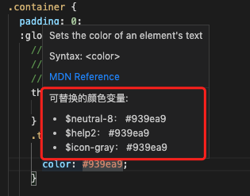
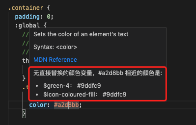

# qingcloud-color-tips 

> 这是一个在vscode插件，可以在scss或stylus文件里hover颜色css提示公共颜色变量，支持相同颜色变量及相近颜色变量两种情况的变量提示。

<i>注：该项目使用的是青云项目中使用的颜色库，不含其他涉密文件</i>

## 示例

* 相同颜色变量提示

* 相近颜色变量提示

## 安装方法

vscode插件菜单中搜索 `qingcloud-color-tips` 即可安装

## 二次开发

如需更换颜色库，可fork并修改项目中的scss-variable.scss变量，正常发布vscode插件即可

